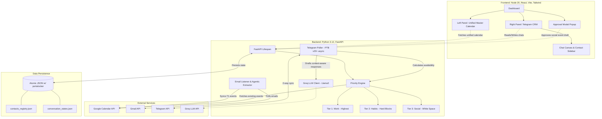
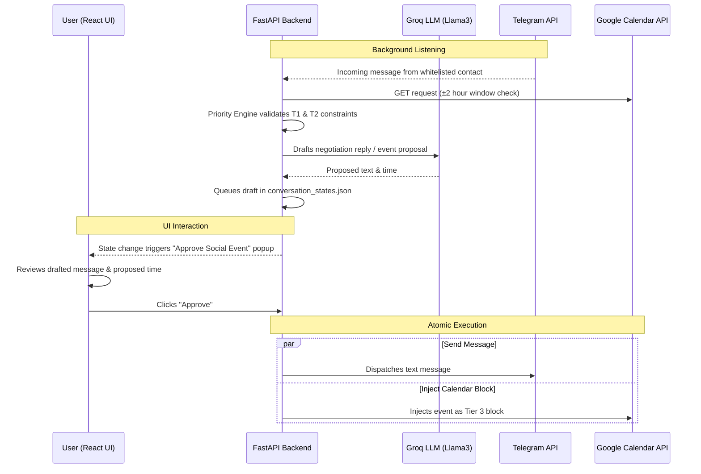

# Omni-Assistant Project Architecture

UML architecture diagram mapping out the Frontend, Backend, External APIs, and Storage for the Omni-Assistant project.

## System Architecture

## Social Event Approval Flow

This sequence diagram illustrates the required UI-driven approval loop for Tier 3 Social Events, highlighting the strict constraints mentioned in the rules.

